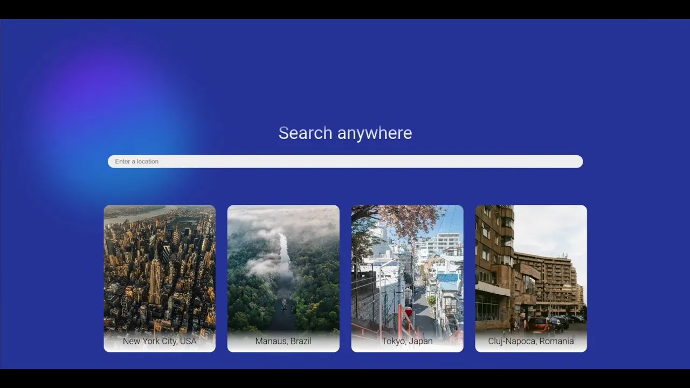

# City Weather
### City Weather is a weather forecasting website using several APIs, styling libraries and React JS.

## Demo video

## Concepts tested
- usage of multiple APIs
- css animations
- css modules for styling
- using graphs
- page transitions
- usage of search bars
- animated icons

# Sources used
[CSS Modules](https://github.com/css-modules/css-modules)   
[Select Component](https://react-select.com/home)   
[Framer library](https://www.framer.com/marketplace/components)   
[Chart.js](https://www.chartjs.org)   
[Chart.js label plug-in](https://chartjs-plugin-datalabels.netlify.app/guide)   
[Static weather icons](https://github.com/mrdarrengriffin/google-weather-icons)   
[Date library](https://date-fns.org)   
[Some features](https://www.hover.dev)

# APIs used
[Google Autocomplete API](ttps://developers.google.com/maps/documentation/places/web-service/legacy/autocomplete)   
[Visual Crossing API](https://www.visualcrossing.com/weather-api/)   
[Google Places API](https://developers.google.com/maps/documentation/places/web-service/overview)   
[Google Youtube API](https://developers.google.com/youtube/v3/getting-started)   

# Issues not fixed
## Phone scaling
The website falls short of delivering satisfactory user experience. After dozens of attempts, its dimensions are way bigger than they should be, with white areas being accessible on vertical scroll. Another downfall is some features not working in smartphone dimensions, but they did work when being tested in Google DevTools and when browser was resized to phone dimentions. Better phone size testing tool is needed.

## Upcoming updates
### Version 1.1 Images zoom in
Feature: When double clicking / tapping on image, it should appear above all others in bigger dimensions, with an exit button on top right.

### Version 1.2 Phone App
Feature: After I learn how to make React Phone apps, this project should get its own phone app as I want to use it in daily life and provide it to my friends and family in the same way.
