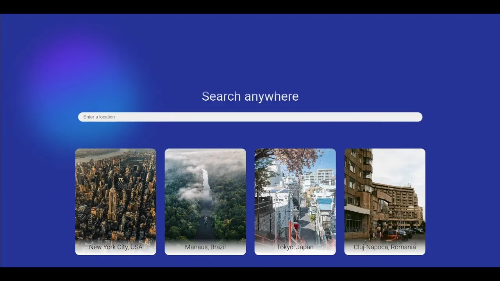

# City Weather
### A weather forecasting website using several APIs, styling libraries and React JS.

## Demo video

## Concepts tested
- usage of multiple APIs
- css animations
- css modules for styling
- using graphs
- page transitions
- usage of search bars
- animated icons

## Features
<ul>
  <li>search any city, with Google Autocomplete  suggesting names as the user types</li>
  <li>weather forecast for the searched cityfrom the Visual Crossing API, shown with charts</li>
  <li>photo gallery of the city, pulled from Google Places</li>
  <li>tour videos of the city captured during a walk, found through the YouTube API within 30 miles of it</li>
  <li>horizontal four-slide layout with page transitions, css animations and animated weather icons</li>
  <li>loading and error screens while the data arrives</li>
</ul>

## How it works
The graph below shows where the data comes from. The search gives the city's coordinates, and those coordinates fan out to three APIs: Visual Crossing for the weather, Google Places for the photos and YouTube for the videos. Everything then renders into the four slides.

## Sources used
[CSS Modules](https://github.com/css-modules/css-modules)   
[Select Component](https://react-select.com/home)   
[Framer library](https://www.framer.com/marketplace/components)   
[Chart.js](https://www.chartjs.org)   
[Chart.js label plug-in](https://chartjs-plugin-datalabels.netlify.app/guide)   
[Static weather icons](https://github.com/mrdarrengriffin/google-weather-icons)   
[Date library](https://date-fns.org)   
[Some features](https://www.hover.dev)

## APIs used
[Google Autocomplete API](https://developers.google.com/maps/documentation/places/web-service/legacy/autocomplete)   
[Visual Crossing API](https://www.visualcrossing.com/weather-api/)   
[Google Places API](https://developers.google.com/maps/documentation/places/web-service/overview)   
[Google Youtube API](https://developers.google.com/youtube/v3/getting-started)   
